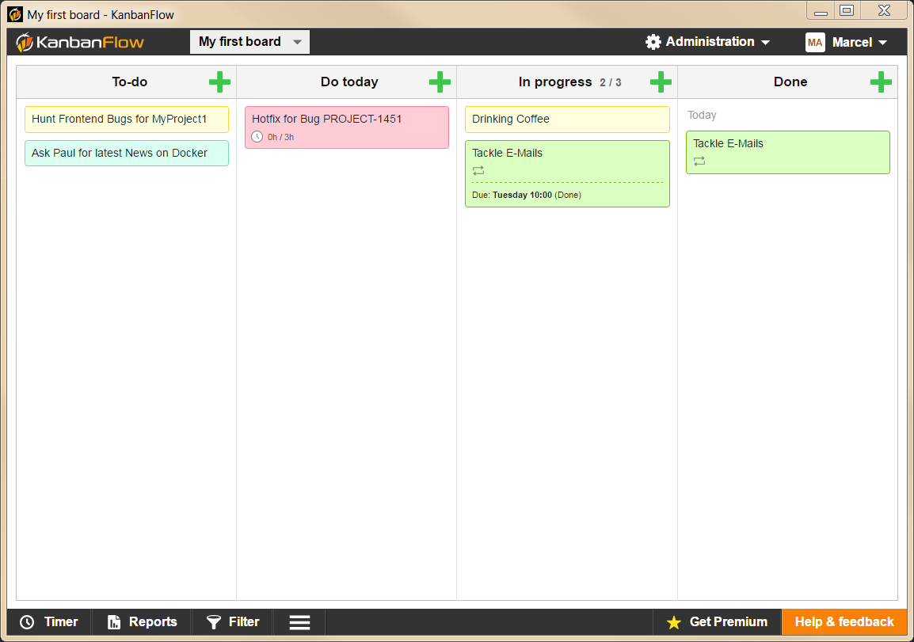

# Kanbanflow Application

[](https://github.com/metawave/kanbanflow-app/actions/workflows/build.yml)

This app wraps the great kanbanflow.com application as a standalone app, built with [Tauri 2](https://tauri.app).



## Usage

Login with your credentials and get work done!

Use the menu to increase/decrease the zoom-factor and to reload the webapp, when you run into unexpected behaviour.

## Development

Requirements: Node.js, Rust and the [Tauri prerequisites](https://tauri.app/start/prerequisites/) for your platform.

```sh
npm install
npm start             # run the app in development mode
npm run lint          # clippy
npm run dist          # build the installers for the current platform
npm run dist:unsigned # same, without the updater signing key
```

## Releases and updates

Pushing a tag `v*` builds all platforms and creates a draft release on GitHub.

The app checks `latest.json` of the latest GitHub release for updates. Updates must be signed:

1. Generate a key pair once: `npx @tauri-apps/cli signer generate -w ~/.tauri/kanbanflow-app.key`
2. Add the private key and its password as repository secrets `TAURI_SIGNING_PRIVATE_KEY` and
   `TAURI_SIGNING_PRIVATE_KEY_PASSWORD`.
3. Put the public key into `plugins.updater.pubkey` and set `bundle.createUpdaterArtifacts` to
   `true` in `src-tauri/tauri.conf.json`.
